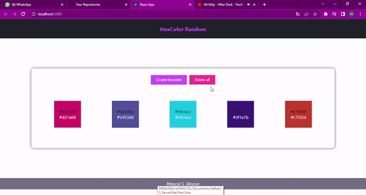

# Hexcode colors

## _Maycol Steven Rincon Bayona_

**Back:** hex-color folder  
**Front:** front-hexcolor folder

## Especificaciones

Base de datos en mongodb con programación reactiva usando el framework de java spring boot.

El front se utiliza la libreria de react y redux para manejar los estados.

Puerto del api: http://localhost:8080/color

## Captures

