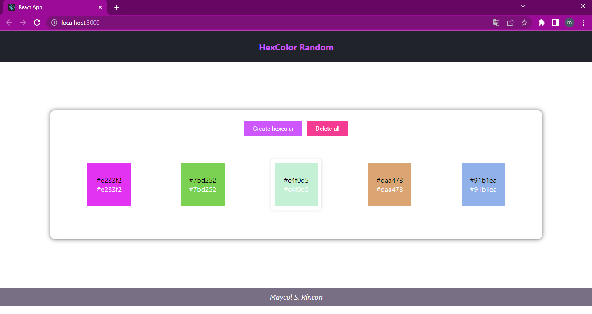
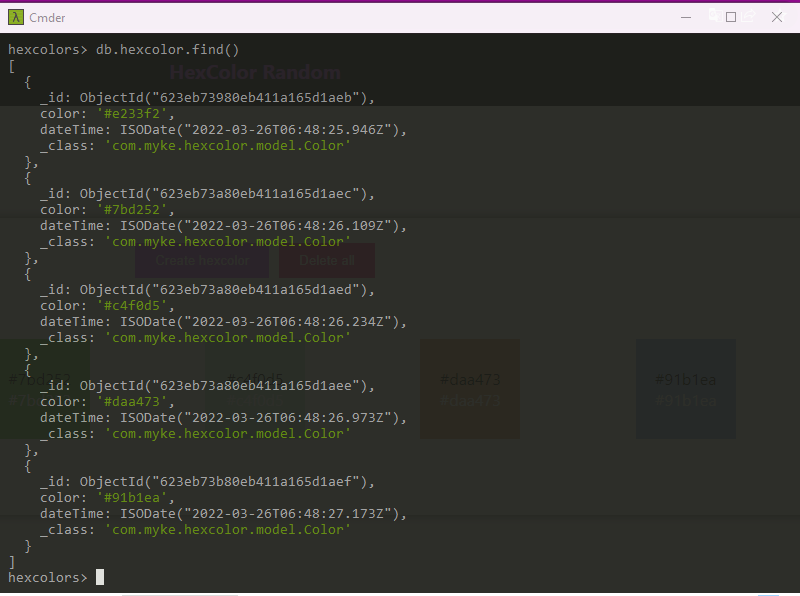

# Hexcode colors

## _Maycol Steven Rincon Bayona_

**Back:** hex-color folder  
**Front:** front-hexcolor folder

## Especificaciones

Base de datos en mongodb con programación reactiva usando el framework de java spring boot.

El front se utiliza la libreria de react y redux para manejar los estados.

Puerto del api: http://localhost:8080/color

Funcionamientos:

- El boton crear hexcolor, genera un codigo hex random que es mostrado con su respectivo color y es guardado en la base de datos con su fecha y hora de creación.
- El boton eliminar, borra todos los colores de la base de datos.

## Captures

Imagen de la pagina:

Base de datos

